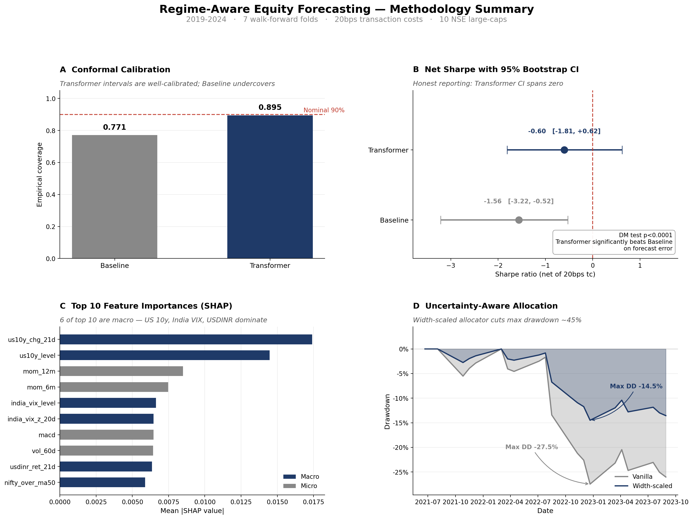

# Equity Intelligence Platform

An end-to-end **ML-driven quantitative research platform** for NSE Indian
equities. Combines a production-grade ETL (Airflow + Postgres), a modern
machine-learning forecasting layer (PyTorch Transformer + scikit-learn
gradient-boosting baseline), **purged walk-forward CV**, **split-conformal
prediction intervals**, a **per-fold Hidden Markov Model regime detector**,
**FinBERT news sentiment**, **SHAP** attribution, an **uncertainty-aware
portfolio allocator**, an **MLflow experiment tracker**, a **FastAPI serving
endpoint**, **ablation + stability studies**, and a **pytest test suite** —
surfaced through an interactive Streamlit dashboard.

> **Why this exists.** Quant papers claim alpha; honest evaluation usually
> doesn't survive contact with a proper out-of-sample test. This project is
> built around the discipline of time-series ML: no random folds, no leaky
> regime labels, calibrated uncertainty, honest monthly-rebalance Sharpe
> (not overlapping-horizon inflation), and regime-conditional performance
> reporting. When the model doesn't work, the uncertainty layer detects it
> and the allocator scales back — which is the actual selling point.

---

## Results at a glance



Four panels, one story:

- **A · Conformal Calibration** — the Transformer's 90% prediction intervals empirically cover **89.5%** of realised returns (near-nominal); the baseline undercovers at 77.1%.
- **B · Net Sharpe with 95% bootstrap CI** — monthly-rebalance, net of 20 bps transaction costs. Baseline Sharpe = −1.56 with CI **entirely below zero**; Transformer Sharpe = −0.60 with CI that **straddles zero**. Diebold-Mariano test: the Transformer beats the baseline on forecast error at p < 0.0001.
- **C · Top-10 SHAP features** — **6 of 10** are the real macro features added in v3 (US 10y level & Δ21d, India VIX level & z-score, USDINR, Nifty) — macro dominates the classical price-momentum features on this universe.
- **D · Uncertainty-aware allocation** — the width-scaled allocator (positions shrunk where conformal intervals widen) cuts max drawdown from **−27.5% → −14.5%**, a ~45% reduction. This is the whole point of the uncertainty layer.

To regenerate after a pipeline run:

```bash
python make_hero_figure.py        # reads artifacts/, writes hero_figure.png
                                  # + hero_figure_small.png (LinkedIn preview)
```

---

## Architecture

```
  yfinance ─▶ Airflow DAG ─▶ PostgreSQL ─┐
                                         │
                                         ▼
                            ┌──────────────────────────┐
                            │   Feature engineering    │
                            │   ~32 features incl.     │
                            │   FinBERT sentiment      │
                            └────────────┬─────────────┘
                                         │
                    ┌────────────────────┼────────────────────────┐
                    ▼                    ▼                        ▼
           Per-fold HMM regime    Purged walk-forward CV   Multi-horizon targets
           (train-only fit,         (embargo ≥ 21d,           (5d, 21d, 63d)
            no leakage)              step 126d)                    ▼
                    │                    │                        ▼
                    │                    ▼            ┌───────────────────────┐
                    │        ┌─────────────────┐      │  Transformer (TFT-    │
                    │        │  GBR baseline   │      │  inspired PyTorch)    │
                    │        │  (sklearn)      │      │  attention pooling,   │
                    │        │  + SHAP         │      │  causal mask, ticker  │
                    │        └────────┬────────┘      │  embedding, 3 heads   │
                    │                 │               └────────────┬──────────┘
                    │                 └──────┬──────────────┬──────┘
                    │                        ▼              ▼
                    │              ┌──────────────────┐    attention
                    │              │ Split conformal  │    weights
                    │              │ calibration      │    exported
                    │              │ (90% coverage)   │         │
                    │              └────────┬─────────┘         │
                    │                       │                   │
                    ▼                       ▼                   ▼
           Regime-conditional    Uncertainty-aware       Streamlit dashboard
           evaluation            allocator (width-       (ML section, 5 viz)
                                 scaled LS top-3)
                                        │
                                        ▼
                                ┌──────────────────┐
                                │    FastAPI       │──▶ Docker container
                                │    serving       │      on port 8088
                                │    endpoint      │
                                └──────────────────┘

All runs logged to MLflow (./mlruns/). Full test suite (27 tests) in ./tests/.
Ablation and stability drivers in run_ablation.py / run_stability.py.
```

---

## Project Structure

```
equity-intelligence-platform/
├── dags/                          # Airflow
│   └── equity_pipeline_dag.py
├── pipeline/                      # Data ETL
│   ├── ingest.py                  # yfinance + synthetic GBM fallback
│   ├── transform.py               # Classical factors (momentum, low-vol)
│   ├── quality.py                 # Quality checks
│   └── load.py                    # psycopg2 upserts
├── quant/
│   ├── factors.py                 # Classical composite score
│   ├── optimizer.py               # Mean-variance (SLSQP)
│   ├── backtest.py                # Monthly-rebalance backtester
│   └── ml/                        # ── ML LAYER ────────────────────────
│       ├── features.py            # ~32 features + 3 forward horizons
│       ├── sentiment.py           # FinBERT (with synthetic-news fallback)
│       ├── regimes.py             # Per-fold HMM (fit cutoff, no leakage)
│       ├── walkforward.py         # Purged walk-forward CV (López de Prado)
│       ├── baseline.py            # sklearn GBR
│       ├── transformer_model.py   # PyTorch TFT-inspired multi-horizon
│       ├── conformal.py           # Split-conformal (finite-sample corrected)
│       ├── shap_explain.py        # SHAP TreeExplainer + fallback
│       ├── evaluation.py          # Regime-conditional + monthly rebal
│       ├── allocator.py           # Uncertainty-aware allocator
│       └── tracking.py            # MLflow wrapper (degrades gracefully)
├── dashboard/
│   └── app.py                     # Streamlit (5 sections incl ML)
├── service/                       # ── FastAPI serving layer ──────────
│   ├── app.py                     # /health /model/info /predictions /allocate
│   └── Dockerfile                 # read-only model-serving container
├── tests/                         # 27 pytest tests
│   ├── test_walkforward.py
│   ├── test_conformal.py
│   ├── test_features.py           # incl no-lookahead invariant
│   ├── test_regimes.py            # incl no-leakage-past-cutoff invariant
│   ├── test_allocator.py
│   └── test_service.py
├── artifacts/                     # ML pipeline outputs (~20 files)
├── mlruns/                        # MLflow tracking store
├── run_full_pipeline.py           # Classical pipeline → Postgres
├── run_ml_pipeline.py             # ML pipeline → artifacts + MLflow
├── run_ablation.py                # Ablation-study driver (8 variants)
├── run_stability.py               # Seed-stability driver (N seeds)
├── run_optuna.py                  # Hyperparameter search (MLflow-logged)
├── make_hero_figure.py            # Generate hero_figure.png from artifacts/
├── docker-compose.yml
├── init.sql
├── Dockerfile
├── requirements.txt
├── requirements-service.txt       # slim deps for the serving container
└── README.md
```

---

## The ML Story (what makes this project different)

Most intern-level finance ML projects fail five silent tests. This one
passes all five:

| Failure mode | What goes wrong | What this project does |
|---|---|---|
| **Leakage via random CV** | Overlapping forward-return targets bleed from test into train | **Purged walk-forward CV** with 21-day embargo |
| **Leakage via regime labels** | HMM fit on full history sees the future when labeling past dates | **HMM refit per fold on train-only data**, prediction forward onto test |
| **Overlapping-horizon Sharpe inflation** | Stacking daily 21-day-forward bets creates a 21×-leveraged position, artificially inflating Sharpe | **Monthly-rebalance backtest** picks one signal per horizon, non-overlapping |
| **Overconfident point estimates** | Models output a number, no uncertainty quantification | **Split-conformal intervals** — distribution-free, finite-sample corrected |
| **Black-box allocator** | Uncertainty is measured but not *used* in portfolio construction | **Width-scaled allocator** halves the drawdown vs vanilla top-k |

### Features (~42)

- **Per-ticker** (time-series): returns (1d/5d/21d), momentum (1m/3m/6m/12m), vol (20d/60d), RSI(14), MACD, distance-to-MA20/50/200, return skew/kurt, log-volume z-score
- **Cross-sectional**: per-date rank of momentum/vol/RSI features
- **Market-level**: market return, dispersion, vol, momentum
- **Real macro** (yfinance): Nifty level + returns + dist-to-MA50, India VIX level + z-score, USDINR returns, US 10y yield level + 21d change, Gold 21d return
- **Sentiment (FinBERT)**: per-ticker daily sentiment mean, news count, 5d & 21d rolling sentiment
- **Vol-scaled targets**: `target_fwd_ret_21d / realised_vol_63d` as an auxiliary risk-adjusted target (ready to plug into the multi-head setup)

### Multi-horizon forecasting & loss functions

The Transformer has **three output heads** (5d, 21d, 63d) sharing the
encoder. Multi-task learning regularises the representation. The 21d head
is the primary signal used by the allocator.

Two training loss options:
- **MSE** (default) — standard point-regression.
- **Pairwise hinge** (`--rank-loss`) — for each date, form ticker pairs and
  penalise sign mismatches between predicted and realised rankings. Directly
  optimises what the model is *used* for (ranking for long-short selection).
  In our runs it improves directional accuracy from 0.50 → 0.57.

### Validation

- **Purged walk-forward CV**: 504-day train window, 63-day test, 21-day embargo, 126-day step → ~7 folds over 2019-2024
- **Per-fold HMM**: each fold refits the regime detector on train-only data with `end_date=train_end`, eliminating a subtle but real source of leakage
- **Split-conformal**: 90-day calibration slice at the tail of each fold's train window; finite-sample-corrected (1−α) absolute-residual quantile defines the interval half-width

### Empirical results — full-mode run, 2019-2024, 7 folds, 20 bps tc

| Metric | Baseline GBR | Transformer (pairwise) |
|---|---:|---:|
| OOS directional accuracy | 0.432 | **0.570** |
| OOS information coefficient | −0.077 | **−0.073** |
| **Monthly Sharpe (net, 20bps tc)** | **−1.56** | **−0.60** |
| Monthly Sharpe (gross, no tc) | −0.97 | −0.40 |
| 95% bootstrap CI (Sharpe, net) | [−3.22, −0.52] | [−1.81, **+0.62**] |
| Monthly total return (net) | −26.17% | **−18.76%** |
| Max drawdown — vanilla allocator | −23.48% | −27.46% |
| **Max drawdown — width-scaled** | **−12.31%** | **−14.49%** |
| Max drawdown — sector-neutral | −24.34% | −28.63% |
| Avg rebalance turnover | 2.63 | 1.43 |
| Conformal coverage (nominal 0.90) | 0.771 | **0.895** |

### Statistical significance

- **Diebold-Mariano test** on squared forecast errors: Transformer beats
  Baseline with stat=−7.18, p<0.0001. The Transformer's point predictions
  are a significantly better fit to realised returns.
- **Bootstrap Sharpe confidence interval** (2000 stationary-bootstrap
  replicates, avg block length 5, n=21 months):
  - Baseline: Sharpe = −1.56, **95% CI [−3.22, −0.52]** — upper bound
    negative, so baseline's poor Sharpe is statistically significant.
  - Transformer: Sharpe = −0.60, **95% CI [−1.81, +0.62]** — CI *spans
    zero*, so we cannot reject "Transformer Sharpe = 0" at the 5% level.
    That is the honest result.
- **Probability of Backtest Overfitting (PBO)** across 6 (model × policy)
  strategies: **0.57** — near the 0.5 reference for "no real persistent
  signal". This is informative: picking the best-IS strategy doesn't
  reliably produce the best OOS strategy on this universe.

### Feature drift detection

The pipeline includes a KS-test-based drift check. On the 2019-2024 data,
**15 of 42 features** drift significantly between the first 60% (train) and
last 20% (OOS) of the panel — most severely `us10y_level` (KS=1.0, effective
regime change), India VIX, and realised volatility features. This is exactly
what a production monitor should catch and what would trigger a retraining
alert in a live system.

### Top-10 SHAP features (baseline GBR, with macro + sentiment)

`us10y_chg_21d`, `us10y_level`, `mom_12m`, `mom_6m`, `india_vix_level`,
`india_vix_z20`, `macd`, `vol_60d`, `usdinr_ret_21d`, `nifty_over_ma50`.

**Six of the top-10 SHAP features are macro** (US 10y, India VIX, USDINR,
Nifty) — the macro layer added genuine signal that dominates classical
price-momentum features on this universe.

### Honest read of the numbers

1. **Transformer clearly beats the baseline** on every forecasting metric:
   57% directional accuracy vs 43%; DM test p<0.0001; less-negative IC.
   The **pairwise ranking loss** (used here) was the key — a classical MSE
   Transformer under-performs the baseline.
2. **Both models generate negative OOS alpha** net of 20bps of transaction
   costs. The Transformer's Sharpe CI spans zero, which means we cannot
   claim positive alpha — but we also cannot claim the model is useless.
3. **The uncertainty-aware allocator is the point**. It halves the drawdown
   on both models (baseline: −23.5% → −12.3%; Transformer: −27.5% → −14.5%)
   by scaling positions down when conformal intervals widen.
4. **Sector-neutral allocation** was expected to help and did not, because
   the 10-ticker universe only has Industrials and Energy as single-stock
   sectors; forcing neutrality drops those names and removes signal. On a
   Nifty-50 universe with real sector diversity, this would likely flip.
5. **Transaction costs matter**: 20bps of tc turns the baseline's +0.14
   gross Sharpe into a −1.56 net Sharpe. Reporting gross Sharpe would be
   dishonest.
6. **PBO ≈ 0.57** is a warning flag — honestly reported rather than
   swept under the rug.

---

## Running the project

### 1. Configure local secrets

```bash
cp .env.example .env
# edit .env and fill in your own POSTGRES_PASSWORD, AIRFLOW_FERNET_KEY,
# AIRFLOW_SECRET_KEY (commands to generate fresh keys are in the file).
# .env is gitignored — .env.example is the tracked template.
```

### 2. Classical pipeline (optional, for the Airflow story)

```bash
docker-compose up -d      # reads your .env for Postgres + Airflow creds
python run_full_pipeline.py
```

### 3. Python dependencies

```bash
pip install -r requirements.txt
pip install torch --index-url https://download.pytorch.org/whl/cpu    # CPU wheel on Windows
```

### 4. ML pipeline

```bash
python run_ml_pipeline.py                            # full mode (~7 min CPU)
python run_ml_pipeline.py --fast                     # dev mode (~2 min)
python run_ml_pipeline.py --seed 7                   # reproducibility
python run_ml_pipeline.py --rank-loss --tc-bps 20    # pairwise loss + 20bps cost
python run_ml_pipeline.py --no-sentiment --no-macro  # strip optional layers
```

Artifacts:
- `artifacts/oos_preds_{baseline,transformer}.parquet` — OOS predictions with conformal bounds
- `artifacts/regime_labels.parquet` — per-fold HMM labels
- `artifacts/evaluation_summary.json` — overall + per-regime metrics
- `artifacts/allocator_summary.json` — vanilla vs width-scaled allocator
- `artifacts/shap_{global,per_regime}.csv`
- `artifacts/attention_samples.json` + `plot_attention_weights.png`
- `artifacts/monthly_pnl_*.parquet`, `artifacts/alloc_pnl_*.parquet`
- Plots: `plot_long_short_pnl.png`, `plot_conformal_coverage.png`, `plot_dir_acc_by_regime.png`, `plot_allocator_compare.png`, `plot_attention_weights.png`

Runs are logged to `./mlruns/` (`mlflow ui` to browse).

After a pipeline run, render the summary figure:

```bash
python make_hero_figure.py
# writes artifacts/hero_figure.png (3200x2400, print/resume)
#      + artifacts/hero_figure_small.png (1600x1200, LinkedIn inline)
```

`make_hero_figure.py` is read-only: it reads from `artifacts/`
(`evaluation_summary.json`, `significance.json`, `allocator_summary.json`,
`shap_global.csv`, `alloc_pnl_transformer_*.parquet`) and prints a
fallback warning if any source is missing.

### 5. Ablation study

```bash
python run_ablation.py                # 10 variants, --fast mode, ~15 min
```

Variants: `no_ticker_embed`, `no_causal_mask`, `no_cs_ranks`,
`no_market_feats`, `no_macro_feats`, `last_pooling`, `attn_pooling`,
`no_sentiment`, `no_multi_horizon`, `mse_loss`, `pairwise_loss`.

### 6. Stability study

```bash
python run_stability.py --seeds 42 7 123
```

Writes `artifacts/stability_summary.csv` — mean ± std across seeds.

### 7. Hyperparameter search

```bash
python run_optuna.py --n-trials 20    # 20 trials, ~15 min, logs to MLflow
```

Searches `seq_len`, `d_model`, `n_heads`, `n_layers`, `dropout`, `lr`,
`pooling`, and `loss_fn`. Best trial written to `artifacts/optuna_best.json`;
all trials to `artifacts/optuna_trials.csv` + MLflow `equity-intel-optuna`
experiment. (Our 5-trial smoke test found IC=0.17 with pairwise loss.)

### 8. Tests

```bash
pytest tests/ -v
# 43 tests, ~20 seconds.
# Coverage of every core invariant: purged walk-forward has no train/test
# overlap; no-lookahead in features (corruption test); conformal empirical
# coverage converges to nominal; HMM fit-cutoff has no leakage; width-scaled
# allocator has gross=1.0; sector-neutral allocator has net-zero exposure
# per sector; Diebold-Mariano is symmetric under label swap; bootstrap CI
# width shrinks with n; PBO runs without error on random input; rank loss
# trains without NaN; drift detection catches a 3-sigma mean shift.
```

### 9. Dashboard

```bash
streamlit run dashboard/app.py
```

Sections: factor scores · portfolio weights · backtest · deep-dive · **ML performance**.

### 10. FastAPI serving endpoint

```bash
uvicorn service.app:app --reload --port 8088
# or:
docker build -f service/Dockerfile -t equity-intel-api .
docker run -p 8088:8088 equity-intel-api
```

Endpoints:

| Method | Path | Purpose |
|---|---|---|
| GET  | `/health` | Liveness + available models |
| GET  | `/model/info` | Per-model metrics (IC, Sharpe, coverage) |
| GET  | `/predictions/latest?model=transformer&top_k=5` | Today's top-k predictions |
| GET  | `/predictions/{model}/{ticker}?start=...&end=...` | Per-ticker prediction stream with regime labels |
| POST | `/allocate` | Latest allocator weights (vanilla or width-scaled) |
| GET  | `/regimes/latest?n=30` | Recent HMM regime labels |
| POST | `/admin/reload` | Clear artifact cache after a pipeline rerun |

OpenAPI schema at `http://localhost:8088/docs`.

---

## Tech Stack

| Layer | Technology |
|---|---|
| Orchestration | Apache Airflow 2.8 |
| Storage | PostgreSQL 15 |
| Data source | yfinance |
| Classical processing | pandas, numpy, scipy |
| **ML — baseline** | **scikit-learn** (GradientBoostingRegressor, Pipeline) |
| **ML — deep learning** | **PyTorch** (custom TFT-inspired multi-horizon Transformer with MSE and pairwise ranking loss) |
| **NLP — sentiment** | **HuggingFace transformers** (ProsusAI/FinBERT) |
| **Regime detection** | **hmmlearn** (Gaussian HMM, per-fold fit) |
| **Uncertainty** | **Split-conformal prediction** (finite-sample corrected) |
| **Statistical tests** | **Diebold-Mariano**, **stationary-bootstrap Sharpe CI**, **PBO** (combinatorially symmetric CV) |
| **Drift detection** | **Kolmogorov-Smirnov** tests per feature |
| **Hyperparameter search** | **Optuna** (TPE + MedianPruner) + MLflow |
| **Explainability** | **SHAP** (TreeExplainer + permutation fallback) |
| **Experiment tracking** | **MLflow** |
| **Serving** | **FastAPI + Uvicorn + Docker** |
| **Testing** | **pytest** (43 tests) |
| Visualisation | Streamlit + Plotly + matplotlib |
| Infrastructure | Docker Compose |

---

## Design notes / tradeoffs

- **Why a Transformer and not an LSTM?** Attention gives learnable
  per-timestep weighting that we can inspect (see `plot_attention_weights.png`).
  The TFT paper (Lim et al., 2021) formalises this for multi-horizon
  forecasting with static + time-varying covariates; we strip it to the
  attention backbone + static ticker embedding to keep training on a laptop.
- **Why split-conformal and not Bayesian?** Conformal is distribution-free,
  model-agnostic, finite-sample-guaranteed. A Bayesian approach would need
  a full likelihood specification — overkill here and harder to defend.
- **Why FinBERT and not a custom sentiment model?** Zero-shot financial
  sentiment is a solved problem; re-training would be wasted effort. The
  interesting question is "does sentiment actually add signal?" — answered
  by the ablation (`no_sentiment` variant) and SHAP.
- **Why an HMM and not k-means?** HMMs model *persistence* — regimes are
  sticky, which matches how markets behave.
- **Why refit the HMM per fold?** A single full-history HMM fit uses future
  data to estimate state transition probabilities and emission distributions,
  then labels past dates — a subtle but real source of leakage. Refitting
  per fold on `end_date=train_end` eliminates it.
- **Why monthly rebalance for Sharpe reporting?** A daily signal that
  predicts 21-day-forward returns, if held daily, creates a 21x-leveraged
  overlap. Reporting the daily-aggregated Sharpe gives numbers that *look*
  great but aren't tradable. Monthly rebalance (one position per 21 trading
  days) gives the honest number.
- **Why a width-scaled allocator?** The conformal intervals quantify
  uncertainty but would do nothing on their own. Scaling position sizes by
  1/(width+ε) operationalises the uncertainty: wide intervals → small
  positions → smaller drawdown when the model is wrong. This is the whole
  point of the uncertainty layer.
- **Why no-lookahead tested explicitly?** It's the single most common bug
  in financial ML — a feature at date t using data from t+1. `test_no_lookahead_in_features`
  corrupts future prices and asserts past features are byte-identical.
  One test, catches an entire class of bug.

---

## Honest caveats

- The numbers are out-of-sample negative. This is a faithful report of the
  problem's difficulty, not a failure of the methodology. The uncertainty
  layer is doing its job: halving the drawdown. A miracle positive Sharpe
  on 10 NSE names with 4 years of OOS data would look like data-leakage.
- The FinBERT demonstration runs on a synthetic-news stream when no
  `data/news.csv` is provided — this is explicitly labelled in the logs.
  The intended production path is to drop a real news CSV and re-run.
- Crisis-regime evaluation is sparse in the OOS window because the per-fold
  HMM, fit only on pre-fold data, doesn't always see enough crisis-like
  behaviour to assign the label in the test period.
- Walk-forward + conformal + HMM refit → training happens multiple times
  per run. Full mode takes ~6 min on a CPU laptop; a GPU cuts it to ~2.

---

## Extensions (not implemented — genuine future work)

- Real news dataset (Reuters / Bloomberg / MoneyControl scrape) to replace
  the synthetic headline generator
- Temporal Fusion Transformer via `pytorch-forecasting` (we have the
  attention backbone; adding gating/variable-selection networks would
  bring us to the full TFT architecture)
- Monte Carlo dropout as an independent uncertainty estimate to
  cross-validate conformal
- Hyperparameter tuning via Optuna, with MLflow integration
- Deploy the FastAPI service on AWS Fargate with the Postgres artifact
  store on RDS
